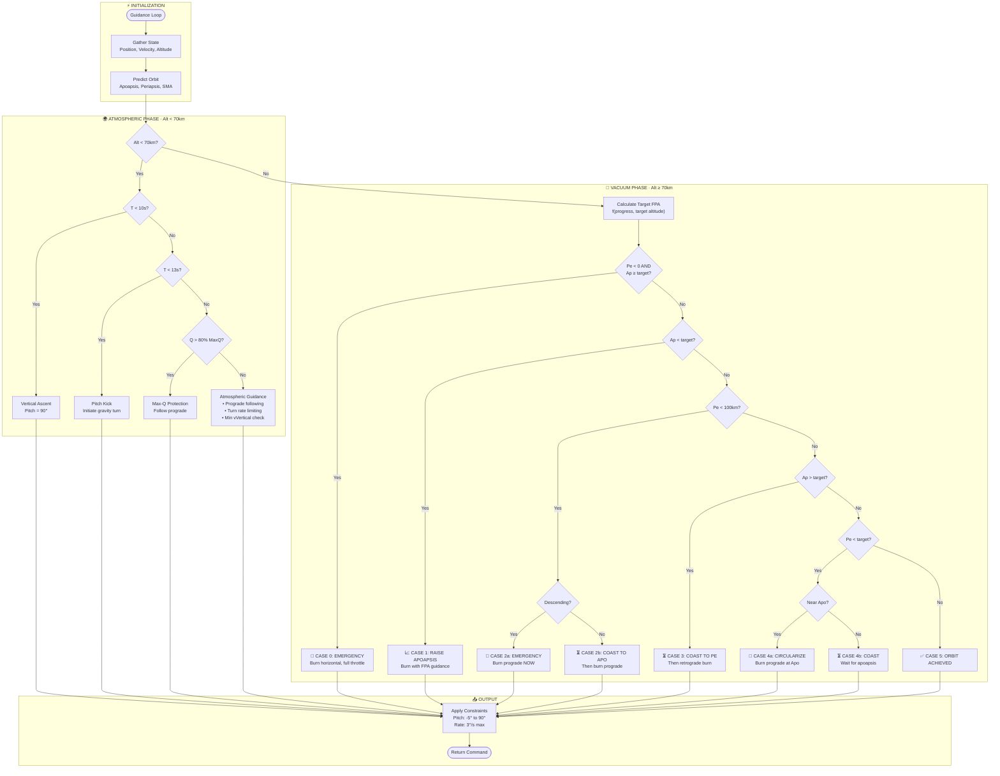

# Rocket
A 2D simulation of orbital mechanics and rocket launch from earth

# Guidance System Flowchart

Copy the mermaid code block below directly into your README.md — GitHub will render it automatically.

## Guidance Cases Summary

| Case | Condition | Action |
|------|-----------|--------|
| **0** | Pe < 0, Ap ≥ target | 🚨 Emergency horizontal burn |
| **1** | Ap < target | 📈 Raise apoapsis with FPA guidance |
| **2a** | Pe < 100km, descending | 🚨 Emergency prograde burn |
| **2b** | Pe < 100km, ascending | ⏳ Coast to Apo, then prograde |
| **3** | Ap > target | ⏳ Coast to Pe, then retrograde |
| **4a** | Pe < target, near Apo | 🔄 Circularize prograde |
| **4b** | Pe < target, far from Apo | ⏳ Coast to apoapsis |
| **5** | Both within tolerance | ✅ Orbit achieved |

## Key Parameters

- **Atmosphere limit**: 70 km
- **Safe periapsis**: 100 km (above atmosphere with margin)
- **Target orbit**: Configurable (default ~400 km circular)
- **Pitch constraints**: -5° to +90°
- **Max pitch rate**: 3°/s